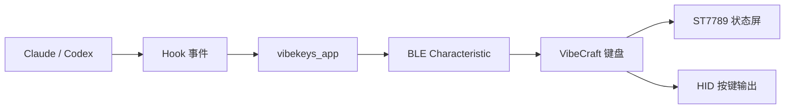

# VibeCraft 键盘 / VibeCraft Keyboard

🔥 A DIY vibe coding keyboard project based on `ESP32-S3`, `BLE HID`, `ST7789`, and rotary input.  
🚀 Built for physical prompt control, status display, configurable keymaps, and Claude/Codex hook integration.  
⭐ Includes Chinese documentation, hardware planning, wiring guides, keymap scripts, and software setup workflow.

<p align="center">
  面向个人学习与 DIY 场景的实体提示键盘项目（屏幕状态显示 / 旋钮导航 / 可编程按键 / Hook 联动）
</p>

<p align="center">
  <a href="https://github.com/however-yir/vibecraft-keyboard/actions/workflows/keyboard-smoke.yml"></a>
  
  
  
  
  
</p>

> Status: `experiment`
>
> Role: hardware interface experiment for prompt control and physical developer workflow tooling
>
> Next priority: BOM refinement, wiring diagrams, real device photos, and firmware artifact publishing

---

## 目录

- [1. 项目概述](#1-项目概述)
- [2. 目标效果与按键布局](#2-目标效果与按键布局)
- [3. 技术路线](#3-技术路线)
- [4. 硬件组成](#4-硬件组成)
- [5. 软件架构](#5-软件架构)
- [6. 仓库结构](#6-仓库结构)
- [7. 快速开始](#7-快速开始)
- [8. 文档索引](#8-文档索引)
- [9. 开发路线](#9-开发路线)
- [10. 结构与尺寸说明](#10-结构与尺寸说明)
- [11. 注意事项](#11-注意事项)
- [12. License](#12-license)

---

## 1. 项目概述

`VibeCraft 键盘` 是一个围绕“vibe coding 实体交互”搭建的个人 DIY 项目，目标是做出一块能够放在桌面上、直接控制编码工作流的提示键盘。它不是普通宏键盘，而是把屏幕状态显示、常用操作、模型切换、提示词输入、旋钮导航和 Hook 联动组合到一套硬件里。

本仓库当前聚焦三个方向：

- 把参考图片中的布局落成一套可复现的硬件方案
- 把固件、上位机、Hook、默认按键映射整理成一条可执行流程
- 为后续 3D 外壳、定制 PCB 和自定义按键行为留出清晰扩展点

这个仓库采用“原创整合项目”的方式组织内容：公开仓库内提供的是项目文档、接线方案、配置模板与脚本骨架，不直接分发第三方上游仓库源码。这样更适合个人持续学习、迭代和公开记录。

当前仓库定位为“文档/流程仓”，不是完整固件源码仓。  
详细边界说明见：[仓库范围说明](docs/repo-scope.md)。

---

## 2. 目标效果与按键布局

本项目按照参考图中的交互逻辑设计一块 7 键 + 旋钮 + 长条屏的小型桌面键盘，默认布局如下：

| 位置 | 外观标签 | 逻辑键位 | 默认用途 |
|---|---|---|---|
| 上方长条屏 | 状态屏 | `DISPLAY` | 显示当前提示状态、模型名称、Hook 事件 |
| 第一排左 | 麦克风图标 | `MIC` | 语音入口或文本宏占位 |
| 第一排中 | `ultrathink` | `CUSTOM` | 高强度思考提示词或自定义命令 |
| 第一排右 | `ESC` | `ESC` | 中断、取消、退出 |
| 第二排左 | `claude` | `SWITCH` | 模型切换、模式切换 |
| 第二排中 | `Plan` | `NEXT` | 计划、下一项、工作流跳转 |
| 第二排中右 | `←` | `BACKSPACE` | 回退或删除 |
| 第二排右 | `Accept` | `ACCEPT` | 确认、提交、执行 |
| 左下角旋钮 | 旋钮 + 按压 | `ROTATE` | 上下导航，按下确认或空格 |

这种布局的目标不是追求“大而全”，而是把最常用、最高频、最需要“手感反馈”的动作实体化。

---

## 3. 技术路线

### 3.1 主控路线

本项目优先选择 `ESP32-S3` 作为主控，原因包括：

- 原生支持较丰富的外设资源，便于同时接按键、屏幕和旋钮
- 适合承载 BLE HID、屏幕刷新、配置存储等组合场景
- 后续扩展语音、Wi-Fi、OTA 时空间更大

### 3.2 软件链路

项目默认按照以下链路组织：



### 3.3 参考上游

本项目的整体路线参考了多个公开项目的思路，但公共仓库内不直接内嵌其源码：

- `vibekeys_firmware`：BLE HID、显示、配置存储、模式切换思路
- `vibekeys_app`：BLE 文本发送、按键映射、Claude Hook 链路
- `vckb`：结构件、PCB 与键盘交互形态参考
- `CH582m_vibe_coding_BLE_keyboard`：低成本思路与实体交互参考

---

## 4. 硬件组成

当前建议的最小可运行 BOM 如下：

| 类别 | 名称 | 数量 | 说明 |
|---|---|---:|---|
| 主控 | ESP32-S3 开发板 | 1 | 建议 16MB Flash |
| 显示 | ST7789 长条屏 | 1 | 对应长条状态屏 |
| 输入 | 机械按键 | 7 | 对应图片中的 7 个实体按键 |
| 输入 | 旋转编码器 | 1 | 需要支持按压 |
| 供电 | USB Type-C 线 | 1 | 样机阶段直接供电 |
| 结构 | 3D 打印外壳 | 1 套 | 后续按图片做斜面与屏幕开窗 |
| 可选 | I2S 麦克风 | 1 | 语音输入增强 |

更详细的硬件清单见：[硬件 BOM](docs/hardware-bom.md)。

---

## 5. 软件架构

当前项目的软件组织思路如下：

1. 硬件层负责按键扫描、旋钮输入、屏幕显示和基础供电。
2. 固件层负责 BLE HID、屏幕内容刷新、按键事件解释和持久化配置。
3. 上位机层负责把文本、按键映射和 Hook 事件发到设备。
4. IDE / Agent Hook 层负责把会话状态同步到屏幕。

推荐的默认行为：

- `ESC`：中断
- `ACCEPT`：确认/回车
- `BACKSPACE`：删除
- `CUSTOM`：发送 `ultrathink`
- `SWITCH`：切换模型或工作模式
- `NEXT`：进入 `Plan` 或下一步
- `ROTATE`：菜单导航

---

## 6. 仓库结构

```text
.
├── README.md
├── LICENSE
├── config
│   ├── claude-settings.example.json
│   └── default-keymap.env.example
├── docs
│   ├── assembly-roadmap.md
│   ├── enclosure-layout-sketch.md
│   ├── firmware-build-and-flash.md
│   ├── hardware-bom.md
│   ├── keymap-hook-profile.md
│   ├── software-setup.md
│   └── wiring-guide.md
└── scripts
    ├── apply-default-keymap.sh
    ├── bootstrap-upstream.sh
    ├── build-firmware.sh
    ├── build-host-tools.sh
    ├── flash-firmware.sh
    ├── lib.sh
    ├── send-demo-status.sh
    └── vibecraft-hook.sh
```

各目录职责如下：

- `docs/`：项目说明、接线、搭建、软件配置与迭代路线
- `config/`：Hook 配置模板与默认键位模板
- `scripts/`：拉取上游、编译固件、烧录设备、发送显示文本和配置默认键位的辅助脚本

---

## 7. 快速开始

### 7.1 拉取仓库

```bash
git clone https://github.com/however-yir/vibecraft-keyboard.git
cd vibecraft-keyboard
```

### 7.2 拉取参考上游

```bash
chmod +x scripts/bootstrap-upstream.sh
./scripts/bootstrap-upstream.sh
./scripts/check_firmware_sources.sh
```

### 7.3 编译上位机

```bash
chmod +x scripts/build-host-tools.sh
./scripts/build-host-tools.sh
```

### 7.4 编译固件

```bash
chmod +x scripts/build-firmware.sh
./scripts/build-firmware.sh keys
```

### 7.5 烧录固件

```bash
chmod +x scripts/flash-firmware.sh
ESP_PORT=/dev/cu.usbmodem1101 ./scripts/flash-firmware.sh keys
```

### 7.6 阅读接线文档并完成样机连线

优先阅读：

- [接线指南](docs/wiring-guide.md)
- [软件搭建说明](docs/software-setup.md)
- [固件编译与烧录实操](docs/firmware-build-and-flash.md)

### 7.7 配置默认键位

```bash
chmod +x scripts/apply-default-keymap.sh
./scripts/apply-default-keymap.sh
```

### 7.8 发送屏幕测试文本

```bash
chmod +x scripts/send-demo-status.sh
./scripts/send-demo-status.sh
```

---

## 8. 文档索引

- [硬件 BOM](docs/hardware-bom.md)
- [接线指南](docs/wiring-guide.md)
- [软件搭建说明](docs/software-setup.md)
- [固件编译与烧录实操](docs/firmware-build-and-flash.md)
- [键位命名与 Hook 文案](docs/keymap-hook-profile.md)
- [外壳尺寸与布局草图](docs/enclosure-layout-sketch.md)
- [装配与迭代路线](docs/assembly-roadmap.md)

### 8.1 Bring-up 文档矩阵

| 任务 | 文档入口 | 对应脚本 | 建议保留的证据 |
|---|---|---|---|
| 锁定采购清单 | `docs/hardware-bom.md` | 无 | 版本化 BOM 表或采购截图 |
| 完成样机接线 | `docs/wiring-guide.md` | `scripts/send-demo-status.sh` | 屏幕点亮照片、按键扫描记录 |
| 编译与烧录固件 | `docs/firmware-build-and-flash.md` | `scripts/build-firmware.sh` / `scripts/flash-firmware.sh` | `.bin` 产物与烧录日志 |
| 配置默认键位 | `docs/keymap-hook-profile.md` | `scripts/apply-default-keymap.sh` | 默认键位截图或导出文件 |
| 联通宿主工作流 | `docs/software-setup.md` | `scripts/vibecraft-hook.sh` | Hook 触发录屏或 GIF |
| 打样结构件 | `docs/enclosure-layout-sketch.md` / `docs/assembly-roadmap.md` | 无 | 外壳渲染图或实物照片 |

### 8.2 固件与演示产物建议

为后续 GitHub Release 准备的最小产物建议如下：

| 产物类型 | 建议命名 | 来源 | 用途 |
|---|---|---|---|
| 固件镜像 | `vibecraft-keys-<version>.bin` | `scripts/build-firmware.sh` | 设备烧录 |
| 默认键位 | `default-keymap-<version>.env` | `config/default-keymap.env.example` | 快速恢复默认映射 |
| 顶视图照片 | `showcase-top-view.jpg` | 样机拍摄 | README 首屏素材 |
| 状态演示 GIF | `status-loop.gif` | Hook 联调录屏 | 展示屏幕与按键反馈 |
| 接线图 PNG | `wiring-overview.png` | 文档导出 | 降低复现成本 |

### 8.3 最小 Bring-up 验收

一块可展示的 VibeCraft 样机，建议至少满足以下门槛：

1. 长条屏可显示状态文本。
2. 七个按键与旋钮事件均可被固件识别。
3. 默认键位可通过配置模板恢复。
4. 宿主机 Hook 能把状态消息发到设备。
5. README 已挂出 BOM、接线、烧录与样机照片。

### 8.4 本地质量检查

提交前建议执行：

```bash
./scripts/check.sh
```

该命令会执行：

1. `shellcheck scripts/*.sh`（若本机无 `shellcheck` 则回退到 `bash -n`）
2. `pytest tests -q`

如需把检查自动接入 Git 提交流程，可执行：

```bash
pip install pre-commit
pre-commit install
pre-commit run --all-files
```

---

## 9. 开发路线

### 9.1 当前阶段

- 完成公开仓库骨架
- 固定图片对应的按键布局与逻辑映射
- 输出可执行的接线方案与脚本模板

### 9.2 下一阶段

- 完成飞线样机与首次点亮
- 打通 BLE、屏幕显示和默认按键映射
- 验证 Hook 联动是否稳定

### 9.3 后续阶段

- 优化 3D 外壳
- 规划定制 PCB
- 增加更多模式、状态页和自定义键帽设计

---

## 10. 结构与尺寸说明

当前第二版文档已经把参考图进一步落到了结构层，包含：

- 机身建议尺寸
- 两排按键与旋钮的推荐坐标关系
- 屏幕开窗和安装槽的建议尺寸
- 适合首版 3D 打印外壳的厚度与斜面建议

详见：[外壳尺寸与布局草图](docs/enclosure-layout-sketch.md)。

## 11. 注意事项

- 本项目当前定位为个人学习与 DIY 公开记录仓库。
- 公共仓库内提供的是原创文档、脚本和整合方案，不直接分发第三方上游仓库源码。
- 实际烧录和硬件装配前，请先完成电源、引脚、屏幕接口和按键防呆检查。
- 如果后续加入电池、充电或便携外壳，请把安全设计放在第一优先级。

## 12. License

本仓库内原创内容采用 `MIT License` 发布，详见 [LICENSE](LICENSE)。
